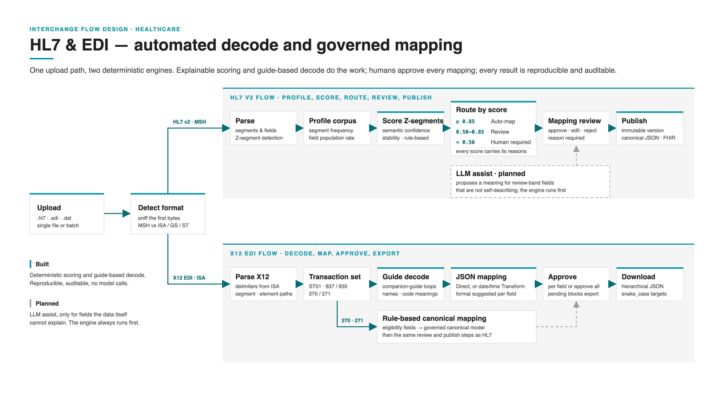
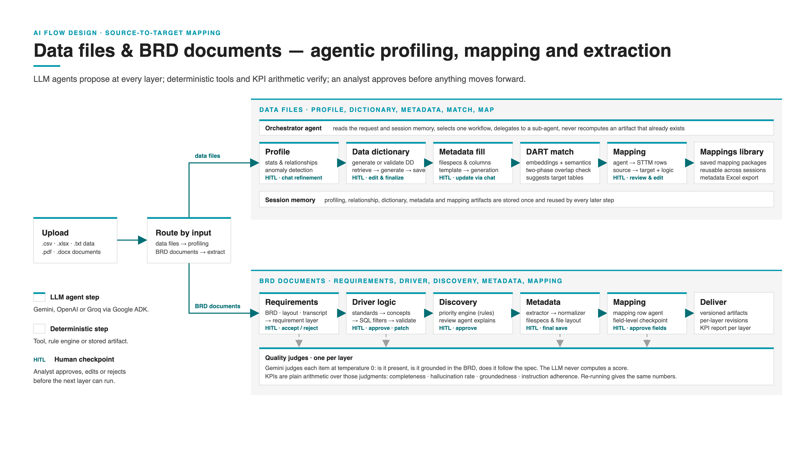

# STTM Standalone

Self-contained **Source-to-Target Mapping (STTM)** application. Copy this entire folder to run or deploy outside the AI Launchpad monorepo.

```
sttm-standalone/
├── backend/          # FastAPI API (agents, profiling, mapping, HL7)
├── frontend/         # React + Vite UI
├── docker-compose.yml
├── start.sh
├── .env.example
└── README.md
```

## Quick start (local)

```bash
cp .env.example .env
# Edit .env — set GOOGLE_API_KEY (or GROQ_API_KEY)

chmod +x start.sh
./start.sh
```

Open **http://127.0.0.1:5173** — no login required.

Upload **`.hl7`** or **`.edi`** (HIPAA X12, e.g. 270/271 eligibility) on the Upload page for profiling and canonical mapping review (same flow as HL7).

API health: **http://127.0.0.1:8000/health**

## Flow diagrams

Two upload paths, documented as presentation-ready diagrams in [`docs/`](docs/) (SVG source plus 4K PNG render).

### HL7 & EDI — automated decode and governed mapping

Deterministic path. HL7 v2 Z-segments are scored (semantic confidence + stability) and routed by threshold; X12 837/835 are decoded from the companion guides and mapped to JSON with per-field approval. No model calls today; LLM assist is marked as planned.



Source: [`docs/ai-flow-hl7-edi.svg`](docs/ai-flow-hl7-edi.svg)

### Data files & BRD documents — agentic profiling, mapping and extraction

LLM path (Gemini / OpenAI / Groq via Google ADK). Data files go through the orchestrator agent (profile → dictionary → metadata → DART match → mapping); BRD documents go through the extract pipeline (requirements → driver → discovery → metadata → mapping) with per-layer quality judges and deterministic KPIs. Every layer has a human checkpoint.



Source: [`docs/ai-flow-sttm-extract.svg`](docs/ai-flow-sttm-extract.svg)

## Docker

```bash
cp .env.example .env
docker compose up --build
```

- Frontend: http://localhost:5173
- Backend: http://localhost:8000

## Production images

```bash
docker build -t sttm-backend:latest ./backend
docker build -t sttm-frontend:latest --target production \
  --build-arg VITE_API_BASE_URL=https://your-api.example.com \
  ./frontend
```

Set `DATAMAP_CORS_ORIGINS` on the backend to your frontend URL.

## Environment variables

| Variable | Purpose |
|----------|---------|
| `GOOGLE_API_KEY` | Gemini / ADK agents |
| `GROQ_API_KEY` | Alternative LLM (`LLM_PROVIDER=groq`) |
| `APP_SESSION_AUTH_MODE` | `dev` (no login; fixed `local-user`) |
| `DATAMAP_CORS_ORIGINS` | Allowed frontend origin(s) |
| `VITE_API_BASE_URL` | Frontend → API URL (production build) |

## Auth

No login or SSO. All app sessions are scoped to a fixed backend identity (`local-user`). Suitable for single-team / trusted-network deployments.

## Export

Copy the whole `sttm-standalone/` directory to a new repo or server. No dependency on the parent Launchpad project.
